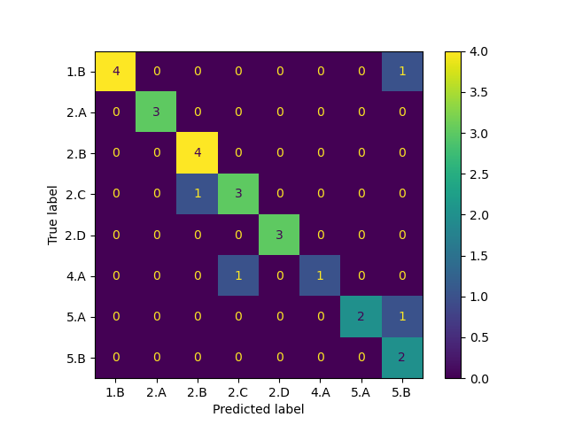
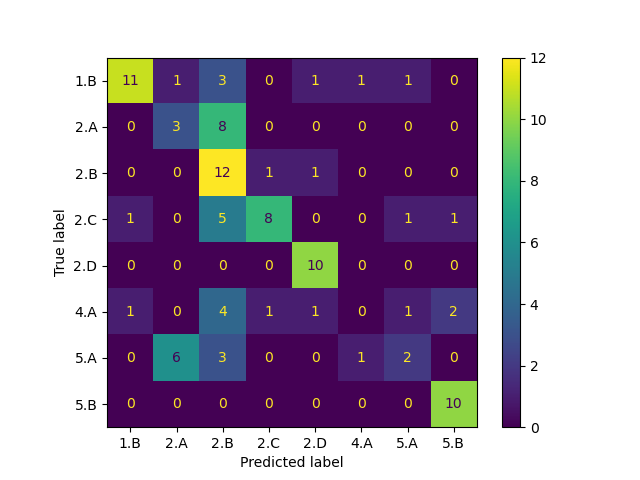

# Evaluating Curriculum Rigor
## Background
In my experience with high school curriculum, I have found a wide variation in the rigor of course material.  This project seeks to develop a tool for evaluating the rigor of a curriculum, by measuring its alignment to the College Board's respective AP Course.  This project focuses on the College Board's AP Computer Science A course, which covers a first year Java and Object Orientied Design course.

For this course, the College Board defines a set of "Computational Thinking Practices" (skills) and content that will be assessed on a year-end summative assessment to determine student's mastery of the course.   

There are 5 main Computational Thinking Practices identified by the College Board, which it then breaks down into subskills:  

 

In addition, the College Board defines a set of "Essential Knowledge" (the content) to be assessed in the course, which it organizes under 5 "Big Ideas."  For example, the content for a lesson on iteration is: 


Every question on the College Board's end-of-course summative exam is aligned to a particular computational thinking skill and essential knowledge.  As a note, some school networks have found the College Board's standards to be very complete, and "backwards plan" their middle school and pre-AP high school courses to prepare students for the AP level work. 

As a first step, this project will focus on the assessment questions used in a particular curriculum, and measure how well they align to the College Board's Computational Thinking Practice and Curriculum Framework.  (As a note, AP classes in most subjects have an analagous set of  thinking practices and framework standards, so one day, this work may be generalized to assess curriculums in other subject areas.)

The three questions to assess are:  

1. How accurately does a simple classifier using either a TF-IDF or SentenceTransformer vectorizer identify the Computational Thinking Practice assessed in a question?  
2. How accurately does ChatGPT, supplied with only the College Board Framework for Computational Thinking and a few sample questions, identify the Computational Thinking Practice assessed in a question?  
3. Can a useful Dashboard be created to improve the quality of an assessment question?

### Initial Conclusions:
1. The classifier using a TF-IDF vectorization accurately identified the Computational Thinking Practice being accessed in 70% of the questions, while the simple classifier using the Sentence Transformed identified the Computational Thinking Practice being assessed in 85% of the questions. 
2. ChatGPT had an accuracy of 48% in identifying the Computational Thinking Practice assessed in a question.

### Next Steps:
1. Develop better prompts to improve ChatGPT's classification accuracy.
2. Determine whether the classifier can also identify the "Essential Knowledge" assessed by the question, not just the computational skill.
3. Attempt to generalize the classifiers to classify non-assessment questions such as lecture material, lab questions, and homework problems.
4. Create a visualization that shows the distribution of thinking skills and content assessed over the course of the curriculum.


## Classifying Questions Using Logistic Regression
As first step, this section will try to classify prompts as assessing one of these two AP Computational Thinking Practices (CTP):
1. **CTP 2.A**: Apply the meaning of specific operators.  For example:  
*Consider the following code segment.*  
```
int x = 7;  
int y = 3;  
if ((x < 10) && (y < 0))  
  System.out.println(""Value is: "" + x * y);  
else  
  System.out.println(""Value is: "" + x / y) 
```
*What is printed as a result of executing the code segment?*

2. **CTP 2.B**: Determine the results or output based on statement execution order in a code segment without method calls (except for output).  For example:  

*Consider the following code segment.* 
```
int[] arr = {7, 2, 5, 3, 0, 10};  
for (int k = 0; k < arr.length - 1; k++)  {  
  if (arr[k] > arr[k + 1])  
    System.out.print(k + "" "" + arr[k] + "" "");  
} 
``` 
*What will be printed as a result of executing the code segment?*  

## Preprocessing the Data
In this first step, we will:
1. Load questions assessing each Computational Thinking Practice.
2. Filter the question set to only consider the most frequently assessed Computational Thinking Practices.

## Testing the Logistic Regression Classifier on the Questions
Here, we build and evaluate a classifier that vectorizes questions using the TF-IDF vectorizer, and classifies using a Logistic Regression Classifier.  


### Interpreting the Logistic Classifier to Identify Key Features
Determine the most significant works for identifying each question.


## Classification with Sentence Transformer Encoding
Next, the questions will be vectorized using a Sentence Transformer Embedding, which may capture some of the semantics in the question lost in the earlier TF-IDF vectorier.  



## Build and Test a ChatGPT Classifier
This classifier asks ChatGPT to determine the Computational Thinking Skill being assessed in the problem.  
1.  Create a function call to ask ChatGPT for the classification
2.  Test ChatGPT on data set and evaluate classification.



## Summary  
This project had some success at identifying the skills assessed in a particular question.  

1. The classifier using a TF-IDF vectorization accurately identified the Computational Thinking Practice being accessed in 70% of the questions, while the simple classifier using the Sentence Transformed identified the Computational Thinking Practice being assessed in 85% of the questions. 
2. ChatGPT had an accuracy of 48% in identifying the Computational Thinking Practice assessed in a question.
3. A simple tool was developed for identifying the skill assessed by a question 

### Next Steps:
1. Develop better prompts to improve ChatGPT's classification accuracy.
2. Determine whether the classifier can also identify the "Essential Knowledge" assessed by the question, not just the computational skill.
3. Attempt to generalize the classifiers to classify non-assessment questions such as lecture material, lab questions, and homework problems.
4. Create a visualization that shows the distribution of thinking skills and content assessed over the course of the curriculum.